# HID® Amico™ VL35LF Biometric Reader User Guide

*PLT-07752, A.0 — April 2025*

---

<!-- Page 1 -->

HID® Amico™ VL35LF Biometric Reader User Guide

HID® Amico™ VL35LF
Biometric Reader
User Guide

PLT-07752, A.0
April 2025

---

<!-- Page 2 -->

                 Powering                                                            HID® Amico™ VL35LF Biometric Reader
                 Trusted Identities                                                                          User Guide

Copyright
© 2025 HID Global Corporation/ASSA ABLOY AB. All rights reserved.

This document may not be reproduced, disseminated, or republished in any form without the prior written permission of
HID Global Corporation.

Trademarks
HID GLOBAL, HID, the HID Brick logo, HID iCLASS, HID iCLASS SE, OMNIKEY, HID Origo, HID PROX, Seos, SIO, and
HID Amico are trademarks or registered trademarks of HID Global, ASSA ABLOY AB, or its affiliate(s) in the US and other
countries and may not be used without permission. All other trademarks, service marks, and product or service names
are trademarks or registered trademarks of their respective owners.

MIFARE, MIFARE Classic, MIFARE DESFire, MIFARE DESFire EV1, MIFARE Plus and MIFARE Ultralight are registered
trademarks of NXP B.V. and are used under license.

Contacts
For technical support, please visit: https://support.hidglobal.com.

What's new
 Date               Description                                                                             Revision
 April 2025         Initial release.                                                                        A.0

A complete list of revisions is available in Revision history.

PLT-07752, A.0                                                   2                                                April 2025

---

<!-- Page 3 -->

                                                          Powering                                       HID® Amico™ VL35LF Biometric Reader
                                                          Trusted Identities                                                     User Guide
HID® Amico™ VL35LF Biometric Reader User Guide                                                                                                  1

Introduction                                                                                                                               6
                         1.1 Document purpose                                                                                              7
                         1.2 Intended audience                                                                                             7
                         1.3 Interaction with the reader                                                                                   7
                                                 1.3.1 To access the on-screen administration menu                                         7
                                                 1.3.2 To access the web interface                                                         7
                         1.4 Home screen                                                                                                   8
                                                 1.4.1 Status bar                                                                          8
                                                 1.4.2 Standard command buttons                                                            9
                         1.5 Main menu                                                                                                    10
                         1.6 Text editing screen                                                                                          11
                         1.7 Options box                                                                                                  12

Enroll and manage users                                                                                                                   13
                         2.1 User enrollment                                                                                              14
                                                 2.1.1 User attributes                                                                    14
                         2.2 User verification                                                                                            15
                         2.3 Enrollment                                                                                                   15
                         2.4 Users                                                                                                        16
                                                 2.4.1 Search for a user                                                                  16
                                                 2.4.2 Register new users                                                                 17
                                                 2.4.3 Credential enrollment                                                              19
                                                 2.4.4 Enroll facial biometrics                                                           19
                                                 2.4.5 Enroll a card                                                                      20
                                                 2.4.6 Schedules                                                                          21
                                                 2.4.7 Edit a user                                                                        21
                                                 2.4.8 Delete a user                                                                      22
                                                 2.4.9 Delete administrators                                                              22
                         2.5 Departments                                                                                                  23
                                                 2.5.1 Create a department                                                                23
                                                 2.5.2 Associate a schedule with a department                                             24
                                                 2.5.3 Associate a user to one or more departments                                        25
                                                 2.5.4 Edit a department                                                                  26
                                                 2.5.5 Delete a department                                                                26
                         2.6 Schedules                                                                                                    27
                                                 2.6.1 Create a schedule                                                                  27
                                                 2.6.2 Assign Schedules to a new user                                                     29
                                                 2.6.3 Assign Schedules to an existing user                                               29
                                                 2.6.4 Edit a schedule                                                                    29

PLT-07752, A.0                                                                                       3                             April 2025

---

<!-- Page 4 -->

                  Powering                                      HID® Amico™ VL35LF Biometric Reader
                  Trusted Identities                                                    User Guide

       2.6.5 Delete a schedule                                                                   29
   2.7 Holidays                                                                                  30
       2.7.1 Create a holiday                                                                    30
       2.7.2 Edit a holiday                                                                      31
       2.7.3 Delete a holiday                                                                    31

Reports                                                                                          32
   3.1 Reports                                                                                   33
       3.1.1 Access report                                                                       34
       3.1.2 Alarm reporting                                                                     36

Configure Access settings                                                                        37
   4.1 Access                                                                                    38
   4.2 Operation mode                                                                            40
       4.2.1 To change the operation mode                                                        40
   4.3 Identification methods                                                                    42
       4.3.1 Enable/disable reader identification methods                                        43
       4.3.2 QR Codes                                                                            44
       4.3.3 Card reading                                                                        45
   4.4 Set Elite and MOB keys                                                                    48
       4.4.1 OMNIKEY Reader Core firmware update                                                 51
   4.5 Hide name on access                                                                       53
   4.6 Identification mode                                                                       54
       4.6.1 Enable Template on card                                                             55
   4.7 External Access Module                                                                    56
   4.8 Validations                                                                               60
   4.9 Wiegand                                                                                   61
   4.10 OSDP                                                                                     64
   4.11 Global network interlocking                                                              67
       4.11.1 To add an interlock                                                                68
       4.11.2 Edit interlocking rules                                                            69

Facial settings                                                                                  70
   5.1 Facial settings                                                                           71
   5.2 General settings                                                                          72
       5.2.1 Region of interest                                                                  75
   5.3 Cameras                                                                                   76
       5.3.1 Diagnostics                                                                         76
       5.3.2 Video streaming                                                                     77
       5.3.3 Camera calibration                                                                  83

PLT-07752, A.0                                              4                             April 2025

---

<!-- Page 5 -->

                  Powering                               HID® Amico™ VL35LF Biometric Reader
                  Trusted Identities                                             User Guide

Settings                                                                                  84
   6.1 Network settings                                                                   85
       6.1.1 Network properties                                                           86
       6.1.2 OpenVPN                                                                      90
       6.1.3 Reader name                                                                  92
   6.2 Date and time                                                                      93
   6.3 Alarms                                                                             96
       6.3.1 Internal alarms                                                              96
       6.3.2 Duress settings                                                              98
       6.3.3 Alarm output                                                                 99
   6.4 Language settings                                                                100
   6.5 System information                                                               101
   6.6 Display                                                                          102
       6.6.1 Display calibration                                                        103
       6.6.2 Power settings                                                             104
       6.6.3 Protection against accidental touches                                      104
   6.7 Diagnostics                                                                      105
   6.8 Modify user name and web password                                                106
   6.9 Restore settings                                                                 107
   6.10 Restart                                                                         108
   6.11 About                                                                           109
       6.11.1 Legal information                                                         110
       6.11.2 Firmware update                                                           111

Technical specifications                                                                112
   7.1 Technical specifications                                                         113

802.1X Status                                                                           115
   A.1 802.1X status                                                                    116

Face capture best practices                                                             117
   B.1 Face capture - best practices                                                    118
   B.2 Image examples                                                                   118

PLT-07752, A.0                                       5                             April 2025

---

<!-- Page 6 -->

Section 01
Introduction

---

<!-- Page 7 -->

                 Powering                                                                  HID® Amico™ VL35LF Biometric Reader
                 Trusted Identities                                                                                User Guide

1.1 Document purpose
This document provides procedures for administrators to set up HID® Amico™ VL35LF and for operators to carry out
tasks associated with enrollment and credential/biometric data management.

1.2 Intended audience
This document is for users with the following roles:
l    HID Amico administrator: set up and configure the HID Amico reader
l    HID Amico operators: install and configure network detected HID Amico readers, enroll people in the system, and
     add credentials and biometric data

1.3 Interaction with the reader
Use the touchscreen to configure all settings of the HID Amico VL35LF reader by accessing the administration menu.
Alternatively, connect the reader to a network, or directly to a PC via an Ethernet cable, and configure the device through
the web interface.

1.3.1 To access the on-screen administration menu
Tap Menu on the touchscreen. The reader does not require any authentication to access the menu before
administrators are enrolled.

    Note: It is recommended to enroll an administrator before starting reader operation.

1.3.2 To access the web interface
    1. Use a web browser to navigate to the default http://192.168.0.129 (or the custom address if you have changed it).
       The login screen is displayed.
    2. Log in using the credentials set during the HID Amico reader set up.

PLT-07752, A.0                                                7                                                      April 2025

---

<!-- Page 8 -->

                 Powering                                                                           HID® Amico™ VL35LF Biometric Reader
                 Trusted Identities                                                                                         User Guide

1.4 Home screen
The home screen displays the current date and time and uses that information to record identification attempts in the
access log, which displays the results of the identification attempt (unidentified, authorized, or unauthorized). The 1.4.1
Status bar is shown at the top of the screen, and the 1.5 Main menu button is shown at the bottom of the screen.

  Note: The home screen can be customized to add buttons or logos.

1.4.1 Status bar

The status bar displays status, operation, and use of the reader.

 Icon                        Description
 Operation status            Flashing under normal operation. A solid icon indicates a problem.

 Network                     Indicates the reader is connected to the network.

 Alarm                       Indicates when an alarm has been triggered.

 Door                        Indicates that the door is open.
                               Note: If there is no door sensor installed, this icon indicates that the relay is open.

PLT-07752, A.0                                                     8                                                          April 2025

---

<!-- Page 9 -->

                 Powering                                                               HID® Amico™ VL35LF Biometric Reader
                 Trusted Identities                                                                             User Guide

1.4.2 Standard command buttons
The following buttons may be displayed on all screens.

 Button                      Function
 Back                        Return to the previous screen.
 Exit                        Return to the home screen.
 OK                          Save any changes made and return to the previous screen.
 Add                         Add users, departments, or schedules.
 More                        Tap for extra menu items.
 Remove                      Remove users, biometrics, cards, or panic fingers.

PLT-07752, A.0                                                 9                                                  April 2025

---

<!-- Page 10 -->

                 Powering                                                              HID® Amico™ VL35LF Biometric Reader
                 Trusted Identities                                                                            User Guide

1.5 Main menu
Tap Menu on the home screen to access the Main Menu.
l   Enroll users, departments, and schedules - see 2.3 Enrollment
l   View reports - see 3.1 Reports
l   Access settings - see 4.1 Access
l   Facial settings - see 5.1 Facial settings
l   Additional settings - see 6.3 Alarms
l   About - see 6.11 About

Log in using your biometrics, card, or password. The main menu is displayed if an administrator logs in.

    Note: If you do not have an administrator account, an Administrator Identify yourself message is displayed.

PLT-07752, A.0                                              10                                                    April 2025

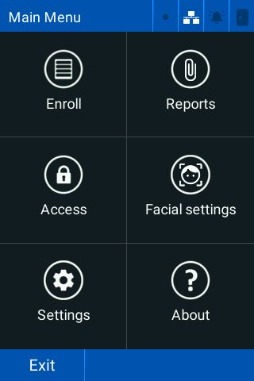

---

<!-- Page 11 -->

                 Powering                                      HID® Amico™ VL35LF Biometric Reader
                 Trusted Identities                                                    User Guide

1.6 Text editing screen
Edit the text field when the keypad (   ) is displayed.

PLT-07752, A.0                                            11                             April 2025

---

<!-- Page 12 -->

                 Powering                                       HID® Amico™ VL35LF Biometric Reader
                 Trusted Identities                                                     User Guide

1.7 Options box
Tap the checkboxes to select multiple options in a list.

PLT-07752, A.0                                             12                             April 2025

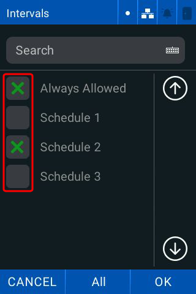

---

<!-- Page 13 -->

Section 02
Enroll and manage users

---

<!-- Page 14 -->

                   Powering                                                                            HID® Amico™ VL35LF Biometric Reader
                   Trusted Identities                                                                                          User Guide

2.1 User enrollment
The enrollment process includes:
l   Enrollment of a unique identification code (ID)
l   Enrollment of identification factors (for example, biometric templates, card, or password)
l   Assign users with additional data such as names, departments, schedules or administrator privileges (optional)

Users are associated with the Standard department by default. You can associate the user with another department or
schedule.

    Note: A user must be associated with a department or schedule to access any areas controlled by a reader.

2.1.1 User attributes
Each user can have the following attributes:

 Attribute                        Description
 ID                               A unique numerical value (15 digits maximum).
 Name (optional)                  A user name helps facilitate identification for reports and user lists. This
                                  field is blank by default.
 Departments                      Associates a group of users with common schedules simultaneously.
 Photo                            Photo assigned to a user's biometric template during enrollment.
 Proximity card                   Proximity card(s) assigned to a user.
 Password                         A numeric password to identify a user.
                                    Note: A password is a non-unique number and can be used by multiple
                                          users with different IDs.

 PIN                              A unique numeric password to authenticate a user.
 Privilege level                  Administrator, or normal user.
 Schedules                        Allows user access for a defined time period(s).
 Registration number (optional)   A number for recording purposes only.
                                    Note: Registration is not a method of user identification within
                                          HID Amico. You can use it to keep your own external record of
                                          users.

 Opening timeout                  A custom for each user.

    Note: Manage users through both the HID Amico reader touchscreen and the web interface.

PLT-07752, A.0                                                       14                                                          April 2025

---

<!-- Page 15 -->

                 Powering                                                                  HID® Amico™ VL35LF Biometric Reader
                 Trusted Identities                                                                                User Guide

2.2 User verification
The HID Amico reader has four forms of identification:
l   Facial biometrics: detects the users face
l   Proximity card: detects the users card
l   Password: validates the users ID and password
l   QR Code: scans a QR Code (in numeric or alphanumeric format)

Registered HID Amico users have two privilege levels:
l   Ordinary user: normal user of the system that can only identify themselves
l   Administrator: full access to the reader

No users are enrolled on the reader by default, and access to the main menu is available to all users.

    Note: It is recommended to enroll an administrator before starting reader operation.

2.3 Enrollment
The registration screen allows you to add, remove, and edit user data.

Tap Menu > Enroll.

PLT-07752, A.0                                               15                                                      April 2025

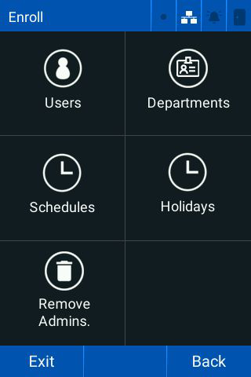

---

<!-- Page 16 -->

                 Powering                                                              HID® Amico™ VL35LF Biometric Reader
                 Trusted Identities                                                                            User Guide

2.4 Users
The Users menu allows you to:
l    Search for users
l    Enroll new users
l    Edit or remove existing users

2.4.1 Search for a user
    1. Tap Menu > Enroll > Users.
    2. Tap Search and enter the user name or user ID.
    3. Tap Confirm.

    Note: HID Amico associates each user with a single person for access where the reader is installed.

    Important: While possible, it is not recommended to associate more than one person with a single user
               (sharing the ID and access password, or registering multiple cards held by different people). This
               harms the consistency of the data recorded in the access and alarm reports.

PLT-07752, A.0                                              16                                                   April 2025

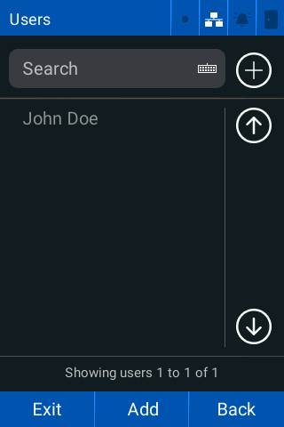

---

<!-- Page 17 -->

                 Powering                                                           HID® Amico™ VL35LF Biometric Reader
                 Trusted Identities                                                                         User Guide

2.4.2 Register new users
 1. Tap Menu > Enroll > Users.
 2. Tap Add.
 3. Enter the required ID and Name.

 4. Tap Department and tap the required departments you want to associate the user with.
 5. Tap the Photo icon and follow the on screen-prompts to assign a photo. See B.1 Face capture - best practices for
    more information. Tap More to continue.

PLT-07752, A.0                                           17                                                   April 2025

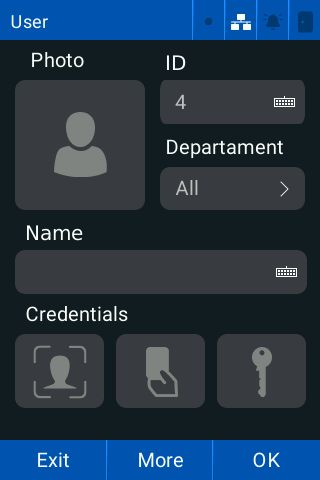

---

<!-- Page 18 -->

                 Powering                                                              HID® Amico™ VL35LF Biometric Reader
                 Trusted Identities                                                                            User Guide

 6. Tap the Registration keyboard and enter a unique user registration number.

 7. Tap the Opening timeout (ms) keyboard and enter the required time a user has to open the door after a user
    identification.
 8. Tap the Pin keyboard and enter the required security key.
 9. Tap the Administrator checkbox to make the user an administrator.
10. Tap Back to return to the previous screen and tap OK.
        Note: The user is automatically linked to the schedules of their associated departments.

PLT-07752, A.0                                              18                                                   April 2025

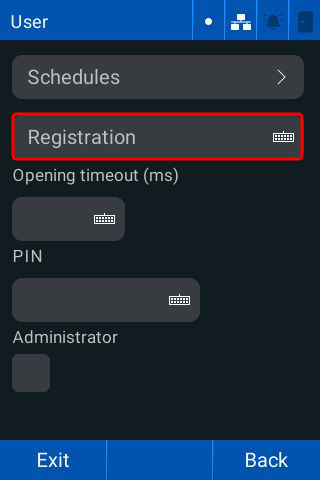

---

<!-- Page 19 -->

                   Powering                                                                  HID® Amico™ VL35LF Biometric Reader
                   Trusted Identities                                                                                User Guide

2.4.3 Credential enrollment
The Advanced Options screen allows you to:
l    Assign a facial biometric to a user
l    Assign a card to a user

2.4.4 Enroll facial biometrics
    1. Tap Menu > Enroll > Users.

    2. Tap the       button. The Facial Registration screen is displayed.
    3. Position your face an appropriate distance from the reader and wait for the identification process.
         Note:
         l If your face is too close or poorly framed, a message prompts you to reposition your face.

          l   The registered face must be unique for each user. If a face is already registered with a different user, an
              error message is displayed and the registration is not carried out.
    4. Position yourself correctly and tap Take Photo. Follow the on-screen prompts to register the image.
         Note:
         l Tap Back to cancel the registration.

          l   If the reader is in Template on Card mode, you will be required to save the template to a Seos® card.

    Note: The facial registration process can also be initiated via the web interface.

PLT-07752, A.0                                                   19                                                     April 2025

---

<!-- Page 20 -->

                 Powering                                                                 HID® Amico™ VL35LF Biometric Reader
                 Trusted Identities                                                                               User Guide

2.4.5 Enroll a card
 1. Tap Menu > Enroll > Users.

 2. Tap the      button.
 3. Hold the card up to the reader.

 4. If successful, a Card number successfully registered! message is displayed.
        Note:
        l If the card is already registered, a Card already registered message is displayed.

        l   If the card cannot be read the operation will time out and return to the previous screen.
 5. Tap OK.

PLT-07752, A.0                                                20                                                    April 2025

---

<!-- Page 21 -->

                 Powering                                                               HID® Amico™ VL35LF Biometric Reader
                 Trusted Identities                                                                             User Guide

2.4.6 Schedules
This allows you to link a user to one or more schedules:

 1. Tap Menu > Enroll > Users > More.
 2. Tap Schedules and tap the required schedules.

 3. Tap Back.
 4. Tap OK.

2.4.7 Edit a user
 1. Tap Menu > Enroll > Users.
 2. Tap the required user.
 3. Tap the required data field and make the required changes.
        Note: To delete specific attributes of a user, tap Remove and tap the required attributes you want to delete.
 4. Tap OK.

PLT-07752, A.0                                              21                                                     April 2025

---

<!-- Page 22 -->

                 Powering                                                          HID® Amico™ VL35LF Biometric Reader
                 Trusted Identities                                                                        User Guide

2.4.8 Delete a user
 1. Tap Menu > Enroll > Users.
 2. Tap the required user.
 3. Tap Remove and select User from the data list.
        Important: You cannot recover any user data after they are deleted. Access logs are available, but only
                   the ID number will be visible.
 4. Tap OK.
 5. Tap OK to remove the selected data.

2.4.9 Delete administrators
  Note: Only registered reader administrators can access the main menu.

To delete an administrator from the reader:

 1. Tap Menu > Enroll.
 2. Tap Remove Admins.

        Important: Deleting an administrator cannot be reversed. The main menu becomes accessible to all
                   users until an administrator is registered to the reader.
 3. Tap OK to remove all administrators.

PLT-07752, A.0                                           22                                                  April 2025

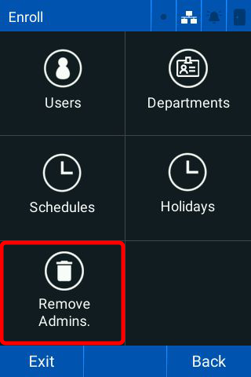

---

<!-- Page 23 -->

                 Powering                                                            HID® Amico™ VL35LF Biometric Reader
                 Trusted Identities                                                                          User Guide

2.5 Departments
The Departments screen allows you to associate users with multiple departments and inherit all the schedules of the
departments they are associated with. Departments associate groups of users with common schedules.

2.5.1 Create a department
 1. Tap Menu > Enroll > Departments.
 2. Tap Add. The Department Creation screen is displayed.

 3. Enter a department name.
 4. Tap OK.
        Note: You can assign a schedule to the department.
 5. Tap OK to save the department.

PLT-07752, A.0                                            23                                                   April 2025

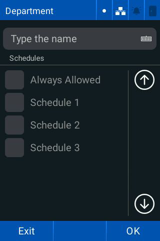

---

<!-- Page 24 -->

                 Powering                                                           HID® Amico™ VL35LF Biometric Reader
                 Trusted Identities                                                                         User Guide

2.5.2 Associate a schedule with a department
You can associate multiple schedules with a single department. Department-linked schedules are applied to users
belonging to that department.

 1. Tap Menu > Enroll > Departments.

 2. Enter the name of the Department in the search bar and tap the required schedules.
 3. Tap OK.
 4. Tap OK to save the department.

PLT-07752, A.0                                           24                                                   April 2025

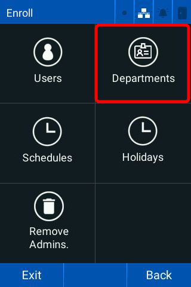

---

<!-- Page 25 -->

                 Powering                                                     HID® Amico™ VL35LF Biometric Reader
                 Trusted Identities                                                                   User Guide

2.5.3 Associate a user to one or more departments
 1. Tap Menu > Enroll > Users.
 2. Tap the required user.
 3. Tap the Departments drop-down menu and tap the required departments.
        Note: You can enter the name of the department into the Search bar.

 4. Tap OK.

PLT-07752, A.0                                            25                                            April 2025

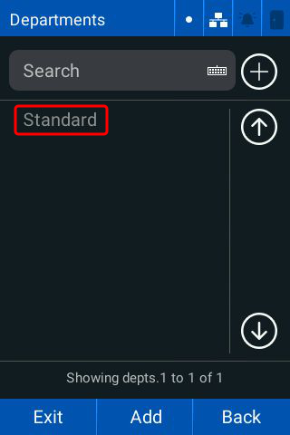

---

<!-- Page 26 -->

                 Powering                                                              HID® Amico™ VL35LF Biometric Reader
                 Trusted Identities                                                                            User Guide

2.5.4 Edit a department
 1. Tap Menu > Enroll > Departments.
 2. Tap the required department.
 3. Tap the required data field and make the required changes.
        Note: The Standard department name cannot be changed.

2.5.5 Delete a department
 1. Tap Menu > Enroll > Departments.
 2. Tap the required department.
 3. Tap Delete.
        Important: The 'Standard' department cannot be deleted.

        Caution: When a department is deleted, all schedules linked to users in the department will no longer be
                 associated with the users.
 4. Tap OK.

PLT-07752, A.0                                             26                                                      April 2025

---

<!-- Page 27 -->

                  Powering                                                                   HID® Amico™ VL35LF Biometric Reader
                  Trusted Identities                                                                                 User Guide

2.6 Schedules
Allows you to determine the time intervals that a specific user or members of a department can be authorized by the
reader.

Schedules are defined by:
l    Name: give schedules a unique name to avoid duplication. Naming the schedule is mandatory.
l    Intervals: contains a time interval (for example, 08:00 to 18:00) and the days of the week that the interval is valid
       Note:
       l Each schedule can have more than one interval

       l   The reader grants access in all intervals of the schedule linked to the user

2.6.1 Create a schedule
    1. Tap Menu > Enroll > Schedules.
    2. Tap Add.

    3. Enter the required Name of the schedule.

PLT-07752, A.0                                                  27                                                      April 2025

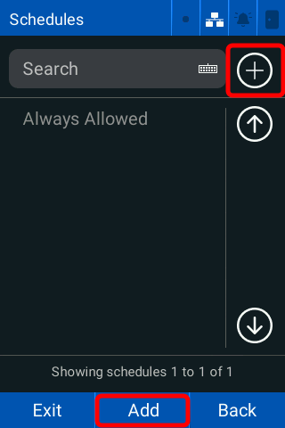

---

<!-- Page 28 -->

                 Powering                                                               HID® Amico™ VL35LF Biometric Reader
                 Trusted Identities                                                                             User Guide

 4. Tap the schedule and tap Edit.

 5. Enter the required Start and End times of the interval and tap the Days of the week that the interval is valid.
        Note: Valid weekdays are displayed in white and invalid weekdays are displayed in gray.
 6. Tap OK.
        Note:
        l Repeat the procedure to add more schedules as necessary.

        l   Holiday types can be associated with valid weekday intervals. See 2.7 Holidays for more information.
 7. Tap OK then tap OK to save the schedule.

PLT-07752, A.0                                               28                                                       April 2025

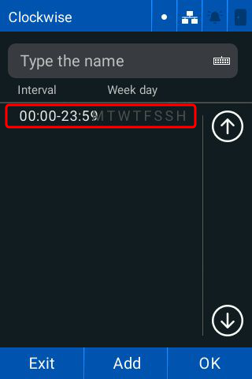

---

<!-- Page 29 -->

                 Powering                                                            HID® Amico™ VL35LF Biometric Reader
                 Trusted Identities                                                                          User Guide

2.6.2 Assign Schedules to a new user
New users do not have a schedule assigned by default so access is always granted. To restrict the users access to
specific time periods, you must assign a schedule to the required user.

 1. Tap Menu > Enroll > Users > Add.
 2. Enter the required information and tap More.
 3. Tap the Schedules drop-down list.
 4. Tap the required schedules.
 5. Tap OK.
 6. Tap Back.
 7. Tap OK, then tap OK to save the user.

2.6.3 Assign Schedules to an existing user
New users do not have a schedule assigned by default so access is always granted. To restrict the users access to
specific time periods, you must assign a schedule to the required user.

 1. Tap Menu > Enroll > Users.
 2. Tap the required user.
 3. Tap More.
 4. Tap the Schedules drop-down list.
 5. Tap the required schedules.
 6. Tap OK.
 7. Tap Back.
 8. Tap OK, then tap OK to save the user.

2.6.4 Edit a schedule
  Note: The Always Released time cannot be edited.

 1. Tap Menu > Enroll > Schedules.
 2. Tap the required schedule.
 3. Tap the required fields and tap Edit.
 4. Make the required changes.
 5. Tap OK then tap OK to save.

2.6.5 Delete a schedule
 1. Tap Menu > Enroll > Schedules.
 2. Tap the required schedule.
 3. Tap Remove.
 4. Tap Remove.
 5. Tap OK to remove the schedule.

  Important: All users linked to the schedule will lose access to the controlled area at the intervals specified by
             the schedule.

PLT-07752, A.0                                            29                                                   April 2025

---

<!-- Page 30 -->

                 Powering                                                                HID® Amico™ VL35LF Biometric Reader
                 Trusted Identities                                                                              User Guide

2.7 Holidays
Allows you to reference special dates when creating breaks. All registered holidays are visible on the Holidays page. The
holiday type allows you to define the type of holiday, for example, national holidays, local holidays, or personal holidays.

    Note: Holiday types are defined during integration.

Holidays are defined by:
l    Name: give holidays a unique name to avoid duplication. Naming the holiday is mandatory.
l    Start date: indicates the start date associated with the holiday
l    Type 1: indicates that the holiday is type 1
l    Type 2: indicates that the holiday is type 2
l    Type 3: indicates that the holiday is type 3
l    Repeats: indicates that the holiday repeats

2.7.1 Create a holiday
    1. Tap Menu > Enroll > Holidays.
    2. Tap the Add icon.
    3. Enter the holiday Name and enter a Start Date.
    4. Tap the required Holiday Type and tap Repeats if required.

    5. Tap OK.

PLT-07752, A.0                                                 30                                                   April 2025

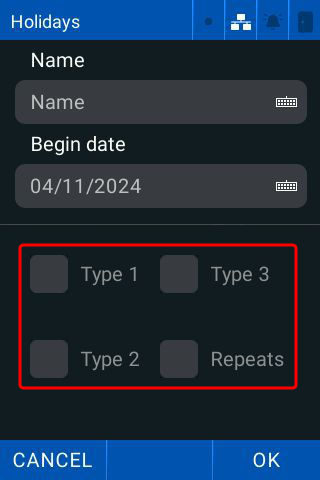

---

<!-- Page 31 -->

                 Powering                                     HID® Amico™ VL35LF Biometric Reader
                 Trusted Identities                                                   User Guide

2.7.2 Edit a holiday
 1. Tap Menu > Enroll > Holidays.
 2. Tap the required Holiday.
 3. Tap the required fields and make the required changes.
 4. Tap OK to save the changes.

2.7.3 Delete a holiday
 1. Tap Menu > Enroll > Holidays.
 2. Tap the required Holiday.
 3. Tap Remove.
 4. Tap OK.

PLT-07752, A.0                                           31                             April 2025

---

<!-- Page 32 -->

Section 03
Reports

---

<!-- Page 33 -->

                 Powering                                                              HID® Amico™ VL35LF Biometric Reader
                 Trusted Identities                                                                            User Guide

3.1 Reports
The Reports screen allows you to list the access and alarms chronologically, from specific time intervals.

Tap Menu > Reports. The Reports screen is displayed.

PLT-07752, A.0                                              33                                                   April 2025

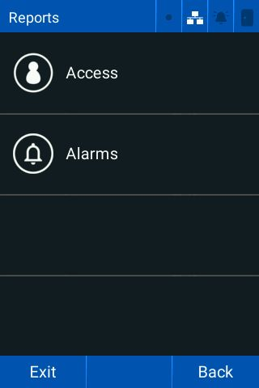

---

<!-- Page 34 -->

                 Powering                                                          HID® Amico™ VL35LF Biometric Reader
                 Trusted Identities                                                                        User Guide

3.1.1 Access report
 1. Tap Menu > Reports > Access. The Access report screen is displayed.

 2. Tap Department and select the required departments to include in the report. Tap OK.
 3. Tap User and select the required users to include in the report. Tap OK.
 4. Tap the Initial date keyboard and enter the required start date.
 5. Tap the End date keyboard and enter the required end date.
 6. Tap Only authorized to only display authorized access events.

PLT-07752, A.0                                             34                                                April 2025

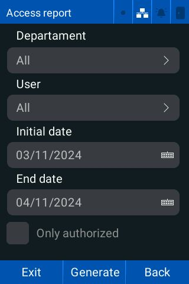

---

<!-- Page 35 -->

                 Powering                                                           HID® Amico™ VL35LF Biometric Reader
                 Trusted Identities                                                                         User Guide

 7. Tap Generate to view the report.
        Note:
        l The report is displayed in reverse chronological order.

        l   A green user name denotes access was granted, a red user name denotes that access was denied.

 8. Tap Exit.

PLT-07752, A.0                                              35                                                April 2025

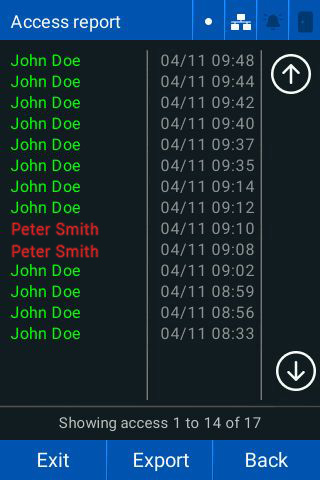

---

<!-- Page 36 -->

                 Powering                                                             HID® Amico™ VL35LF Biometric Reader
                 Trusted Identities                                                                           User Guide

3.1.2 Alarm reporting
 1. Tap Menu > Reports > Alarms. The Alarm report screen is displayed.

 2. Tap Cause and tap the required alarm triggers to include in the report. Tap OK.
 3. Tap the Initial date keyboard and enter the required start date.
 4. Tap the End date keyboard and enter the required end date.
 5. Tap Only activated to only display triggered alarms.
 6. Tap Generate to view the report. The reports screen is displayed.
        Note:
        l The report is displayed in reverse chronological order.

        l   A green alarm denotes access was granted, a red alarm denotes that access was denied.
 7. Tap Exit.

PLT-07752, A.0                                              36                                                  April 2025

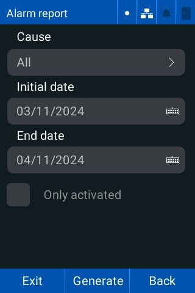

---

<!-- Page 37 -->

Section 04
Configure Access settings

---

<!-- Page 38 -->

                  Powering                                                                        HID® Amico™ VL35LF Biometric Reader
                  Trusted Identities                                                                                      User Guide

4.1 Access
You can configure the following Access settings:

 Setting                        Description
 Operating mode                 Choose between Standalone and Online mode.
 Identification Methods         Choose which methods of identification are enabled on the reader.
 External Access Module (EAM)   Allows you to configure the properties of an external access module.
 Validations                    Configure the Anti-passback settings.
 Wiegand                        Configure the input and output settings for Wiegand transmission.
 OSDP                           Configure the reader as a peripheral device for reading and transmitting
                                information to a control panel.
 Global Network Interlocking    Configure two readers to connect and control a single area by keeping one
                                of the connected doors always closed. For example, a quarantine zone.
 1. Tap Menu > Access. The Access screen is displayed.

PLT-07752, A.0                                                    38                                                        April 2025

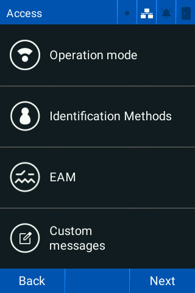

---

<!-- Page 39 -->

                 Powering                  HID® Amico™ VL35LF Biometric Reader
                 Trusted Identities                                User Guide

 2. Tap Next for more options.

PLT-07752, A.0                        39                             April 2025

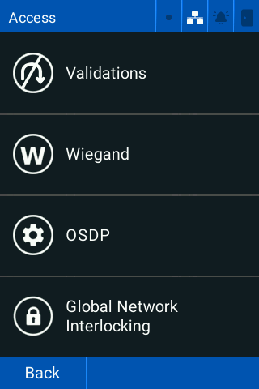

---

<!-- Page 40 -->

                 Powering                                                                   HID® Amico™ VL35LF Biometric Reader
                 Trusted Identities                                                                                 User Guide

4.2 Operation mode
HID Amico has two operating modes:
l    Standalone (default): All information required to identify and authorize access is stored in the HID Amico readers
     local database. For example, user enrollment, biometrics templates, cards, departments, schedules, and access rules.
l    Online: The reader identifies the user in its local database when identification is initiated. Access authorization is done
     through a connected server, which processes the access rules and grants or denies authorization.

4.2.1 To change the operation mode
    1. Tap Menu > Access > Operation Mode. The current operating mode is displayed.

    2. Tap Reconfig.

PLT-07752, A.0                                                 40                                                      April 2025

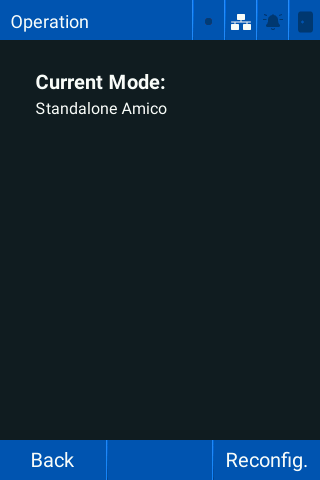

---

<!-- Page 41 -->

                 Powering                  HID® Amico™ VL35LF Biometric Reader
                 Trusted Identities                                User Guide

 3. Tap Yes to select online mode.

 4. Tap Save.
 5. Tap OK to make the changes.

PLT-07752, A.0                        41                             April 2025

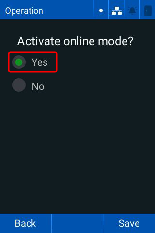

---

<!-- Page 42 -->

                 Powering                                                         HID® Amico™ VL35LF Biometric Reader
                 Trusted Identities                                                                       User Guide

4.3 Identification methods
Tap Menu > Access > Identification Methods. The Identification screen is displayed.

PLT-07752, A.0                                          42                                                  April 2025

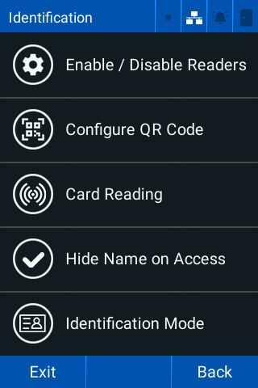

---

<!-- Page 43 -->

                   Powering                                                               HID® Amico™ VL35LF Biometric Reader
                   Trusted Identities                                                                             User Guide

4.3.1 Enable/disable reader identification methods
 1. Tap Menu > Access > Identification Methods > Enable / Disable readers. The Enable Readers screen is
    displayed.

 2. Tap the required identification method toggles to enable/disable them:
      l   Facial: starts the face identification process when a person is detected by the camera.
      l   Card: starts the card identification process when a card is presented to the reader.
      l   QR Code: starts the QR code identification process when a QR code is detected by the camera.
      l   ID and Password: identifies the user from the ID and password entered on the touchscreen.
      l   PIN: identifies the user from the PIN entered on the touchscreen.
            Note:
            l ID and Password, and PIN cannot be enabled together.

            l    Face, Card, QR Code, and ID and Password are enabled by default.
            l    Tap the center of the home screen to display the keypad to enter a Password or a PIN.

PLT-07752, A.0                                                43                                                    April 2025

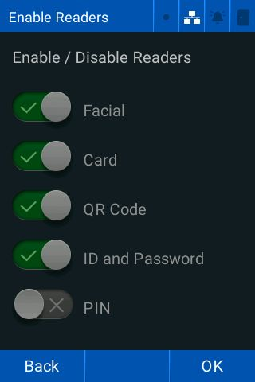

---

<!-- Page 44 -->

                 Powering                                                             HID® Amico™ VL35LF Biometric Reader
                 Trusted Identities                                                                           User Guide

4.3.2 QR Codes
 1. Tap Menu > Access > Identification Methods > Configure QR Code. The QR Code screen is displayed.

 2. Tap the required QR Code reading mode:
      l   Alphanumeric (default): accepts alphanumeric characters as the QR Code. The QR Code is saved as a qrcodes
          object.
      l   Numeric Only (default): the QR Code must be 64-bit numeric. The QR Code is saved as a cards object.
      l   Hexadecimal numeric: the QR Code must be 64-bit hexadecimal numeric. The QR Code is engraved as a cards
          type object.

PLT-07752, A.0                                              44                                                  April 2025

---

<!-- Page 45 -->

                 Powering                                                       HID® Amico™ VL35LF Biometric Reader
                 Trusted Identities                                                                     User Guide

4.3.3 Card reading
The OMNIKEY® Reader Core module parameters can be configured independently via Bluetooth LE connection with the
OMNIKEY Reader Manager application. The communication channel is disabled by default. To temporarily open the
communication channel:

 1. Tap Menu > Access > Identification Methods > Card Reading. The Omnikey SE Reader Core screen is displayed.

PLT-07752, A.0                                        45                                                  April 2025

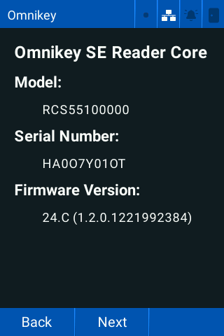

---

<!-- Page 46 -->

                 Powering                                            HID® Amico™ VL35LF Biometric Reader
                 Trusted Identities                                                          User Guide

 2. Tap Next > Reset bluetooth.

        Note: See 4.4 Set Elite and MOB keys for more information.

PLT-07752, A.0                                           46                                    April 2025

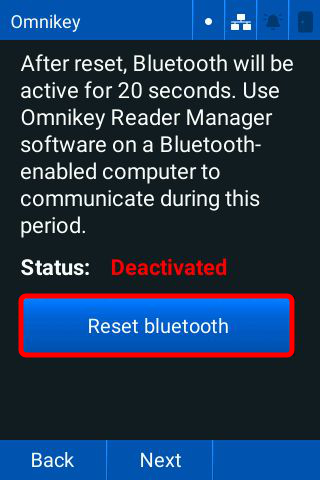

---

<!-- Page 47 -->

                 Powering                                                         HID® Amico™ VL35LF Biometric Reader
                 Trusted Identities                                                                       User Guide

 3. Once the connection is established, tap Next. The card screen is displayed.

 4. Hold the card up to the reader to verify the card details.
        Note:
        The location of each antenna for the supported credentials are:
        l   13.56 MHz - below the screen
        l   LF 125 kHz - above the screen

PLT-07752, A.0                                               47                                             April 2025

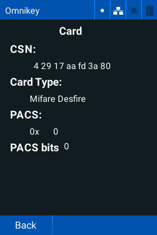

---

<!-- Page 48 -->

                 Powering                                                           HID® Amico™ VL35LF Biometric Reader
                 Trusted Identities                                                                         User Guide

4.4 Set Elite and MOB keys
Download the OMNIKEY Reader Manager app (Microsoft Windows only) to load Elite (ICE) and MOB keys. Search the
Microsoft Store for “OMNIKEY Reader Manager”.

  Note:
  l ICE and MOB keys can only be loaded using a Bluetooth LE connection.

   l   You must have an active HID Origo™ Reader Technician account with ICE and MOB keys assigned.

 1. Open OMNIKEY Reader Manager.
         Note: Make sure Bluetooth is enabled on your computer via Windows System Settings.
 2. Click the User icon to log in to your HID Origo Reader Technician account.

 3. On the HID Amico reader, tap Menu > Access > Identification Methods > Card Reading > Next > Reset
    bluetooth.

PLT-07752, A.0                                            48                                                  April 2025

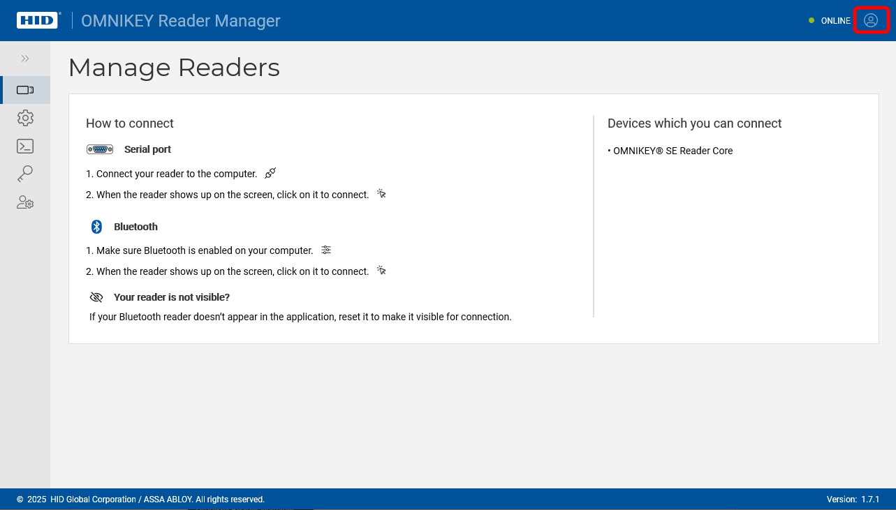

---

<!-- Page 49 -->

                 Powering                                                              HID® Amico™ VL35LF Biometric Reader
                 Trusted Identities                                                                            User Guide

 4. Once the reset is complete, communication between the HID Amico reader and OMNIKEY Reader Manager must
    be established within 20 seconds. If successful, the HID Amico reader will be visible on the OMNIKEY Reader
    Manager screen. Double click the required reader.

        Note: Repeat steps 3 and 4 if the connection times out.

 5. Click the    Key Management icon in the left-hand menu.
 6. Select the required reader to change its keyset. The current reader keyset is displayed.

PLT-07752, A.0                                             49                                                    April 2025

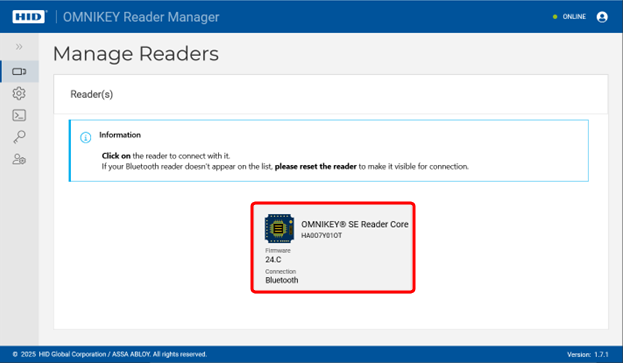

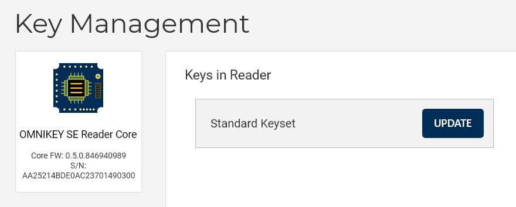

---

<!-- Page 50 -->

                 Powering                                                          HID® Amico™ VL35LF Biometric Reader
                 Trusted Identities                                                                        User Guide

 7. Click UPDATE. The available keysets for the reader are displayed.

 8. Select the required keyset and click NEXT. Secure messages are generated in the cloud and uploaded to the reader.
    This process can take several seconds.

PLT-07752, A.0                                            50                                                 April 2025

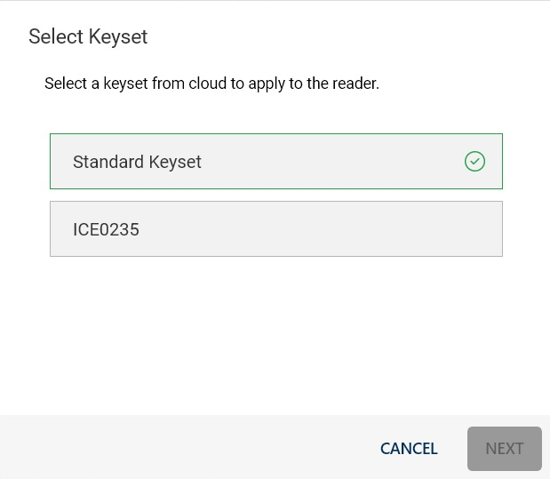

---

<!-- Page 51 -->

                 Powering                                                             HID® Amico™ VL35LF Biometric Reader
                 Trusted Identities                                                                           User Guide

4.4.1 OMNIKEY Reader Core firmware update
 1. Connect to the required device. See 4.4 Set Elite and MOB keys
 2. Click UPDATE READER.

 3. Select the required firmware update file.
        Note: The update package (.orfi) can contain firmware updates for one or more readers.
 4. Click CONFIRM.

PLT-07752, A.0                                             51                                                   April 2025

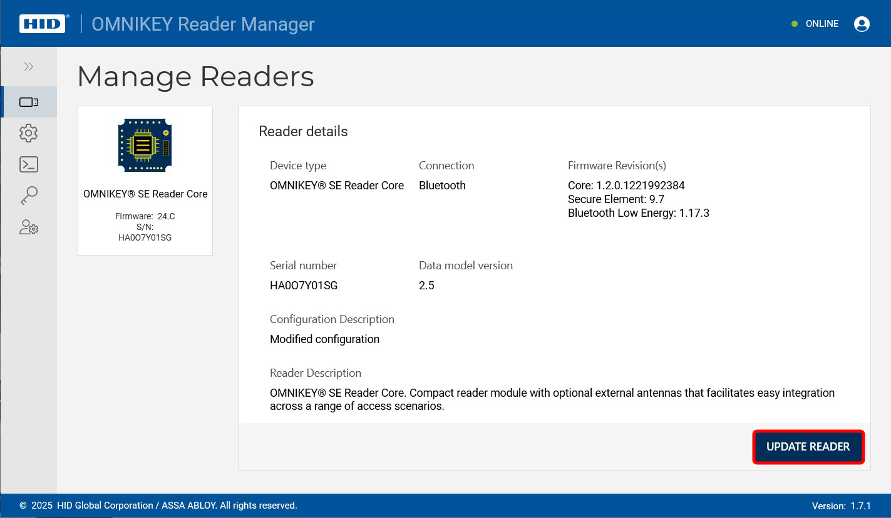

---

<!-- Page 52 -->

                 Powering                                      HID® Amico™ VL35LF Biometric Reader
                 Trusted Identities                                                    User Guide

   5. Click UPDATE READER. The update progress is displayed.

PLT-07752, A.0                                        52                                 April 2025

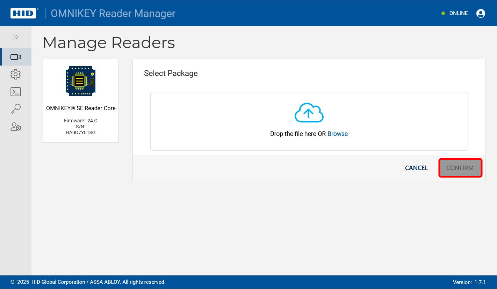

---

<!-- Page 53 -->

                 Powering                                                             HID® Amico™ VL35LF Biometric Reader
                 Trusted Identities                                                                           User Guide

4.5 Hide name on access
This allows you to hide the name of the user during an identification event. This prevents a personal name being
displayed on the reader screen to help avoid identity theft.

Tap Menu > Access > Identification Methods > Hide Name on Access to hide the user name on access.

PLT-07752, A.0                                             53                                                      April 2025

---

<!-- Page 54 -->

                 Powering                                                                            HID® Amico™ VL35LF Biometric Reader
                 Trusted Identities                                                                                          User Guide

4.6 Identification mode
This allows you to manage the required level of reader authentication.

 Mode                Description
 1:N                 Single factor authentication. The reader requires a single form of identification to grant
                     access, for example, Card, Face, Pin, or Password.
 1:1                 Two factor authentication. The reader requires two forms of identification to grant
                     access, for example, a combination of a Card and Face.
 Template on card    Extracts multiple information stored on a card, such as User ID and Template on card.
 QR Code             The camera reads a QR code to grant access to the user. Facial recognition is not
                     available in QR Code mode.
 1. Tap Menu > Access > Identification Methods > Identification Mode.

 2. Tap the required Identification mode.

PLT-07752, A.0                                                      54                                                         April 2025

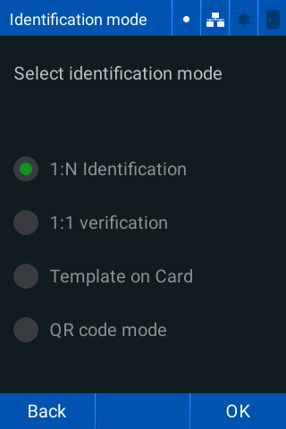

---

<!-- Page 55 -->

                 Powering                                                             HID® Amico™ VL35LF Biometric Reader
                 Trusted Identities                                                                           User Guide

4.6.1 Enable Template on card
For Template on card mode, the user's record and biometric template, is stored on a card instead of the reader's local
database.

 1. Tap Menu > Access > Identification Methods > Identification Mode > Template on Card.

 2. Tap OK to save.

In Template on Card mode, the user must hold their card up to the reader. The reader extracts the face template from
the card and matches it to the user standing in front of the reader.

PLT-07752, A.0                                             55                                                   April 2025

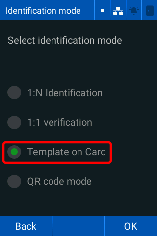

---

<!-- Page 56 -->

                 Powering                                                             HID® Amico™ VL35LF Biometric Reader
                 Trusted Identities                                                                           User Guide

4.7 External Access Module
 1. Tap Menu > Access > EAM. The EAM screen is displayed.

 2. Tap the Door sensor toggle to activate/deactivate the door sensor.
 3. Tap the Sensor mode toggle to set the sensor to Normally Open (NO) or Normally Closed (NC).
 4. Tap the Intelligent closing toggle to set the relay to close when the door sensor opens.
 5. Tap the Time of opening (ms) keyboard and enter the duration (milliseconds) that the EAM relay is open.
        Note: Tap Open door to manually open the door relay.
 6. Tap Next.

PLT-07752, A.0                                            56                                                    April 2025

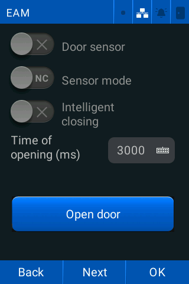

---

<!-- Page 57 -->

                 Powering                                                       HID® Amico™ VL35LF Biometric Reader
                 Trusted Identities                                                                     User Guide

 7. Tap the required Communication mode:
      l   Standard: the EAM can communicate with any reader.
      l   More: the EAM only communicates with the reader that configured it.

PLT-07752, A.0                                             57                                             April 2025

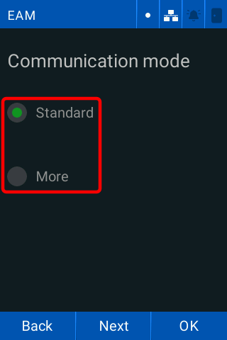

---

<!-- Page 58 -->

                 Powering                                                                HID® Amico™ VL35LF Biometric Reader
                 Trusted Identities                                                                              User Guide

 8. Tap Next and tap the required Exception Mode.
      l   Emergency: in the case of an emergency, the doors are kept unlocked. This must be set manually.
      l   Blocked: in the case of a lockdown, the doors are kept locked. This must be set manually.
      l   Disabled: no exceptions are made. Access control continues as normal.

PLT-07752, A.0                                               58                                                    April 2025

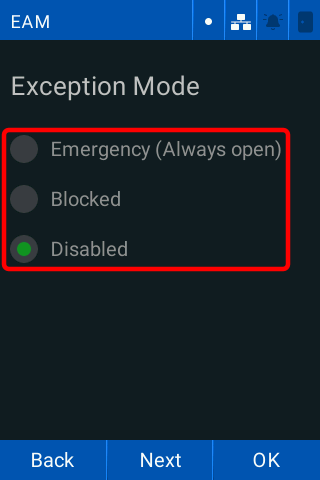

---

<!-- Page 59 -->

                 Powering                                                              HID® Amico™ VL35LF Biometric Reader
                 Trusted Identities                                                                            User Guide

 9. Tap Next and tap Update to update the EAM firmware version.
        Note: Tap Back to return to the previous screen if the EAM firmware is up to date.

10. Tap OK.

PLT-07752, A.0                                              59                                                   April 2025

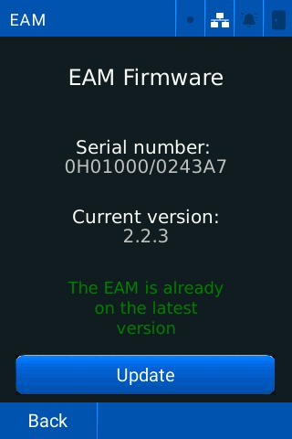

---

<!-- Page 60 -->

                 Powering                                                             HID® Amico™ VL35LF Biometric Reader
                 Trusted Identities                                                                           User Guide

4.8 Validations
The Validations screen allows you to configure the Anti-Passback settings. Anti-passback stops a user entering a
location multiple times in a certain time period. To set the time a user must wait before they are granted access:

 1. Tap Menu > Access > Next > Validations. The Validations screen is displayed.

 2. Tap Enabled to enable Anti-Passback by time.
 3. Tap the Time (minutes) keyboard to set the time in minutes.
 4. Tap the required Access Log Level:
      l   High: reader records all access attempts.
      l   Low: reader does not log failed access attempts.
 5. Tap Next to continue.
 6. Tap the required Clear expired users option:
      l   All: deletes all users with an expired End date.
      l   Visitors: deletes only visitors with an expired End date.
      l   Disable: does not delete any expired users.
            Note: The End date must be set for expired users to be removed.
 7. Tap OK.

PLT-07752, A.0                                                 60                                               April 2025

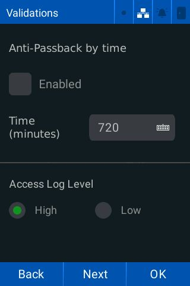

---

<!-- Page 61 -->

                 Powering                                                                HID® Amico™ VL35LF Biometric Reader
                 Trusted Identities                                                                              User Guide

4.9 Wiegand
 1. Tap Menu > Access > Next > Wiegand. The Wiegand Settings screen is displayed.

 2. Tap the required Identification Mode:
      l   ID (default): transmits the user ID over Wiegand
      l   Authorized Card: transmits the authorized card information over Wiegand
      l   Any Card/QR Code/PIN: transmits the card information over Wiegand, whether the card is authorized or not
      l   User card: transmits only user card information over Wiegand, after a facial recognition
 3. Tap Next and tap the required Wiegand format:
      l   Manual - a custom Wiegand format defined in the web interface.
      l   CSN mifare (32 bits)
      l   C1K (35 bits)
      l   W37 (10304)
      l   W42
      l   W56
      l   W66
      l   W26
      l   W34
      l   W37 (10302)
      l   W40
      l   C1K (48 bits)
      l   W64
 4. Tap Next.

PLT-07752, A.0                                                61                                                   April 2025

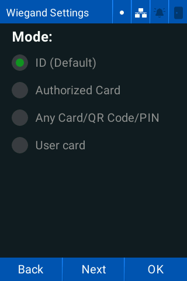

---

<!-- Page 62 -->

                 Powering                                                           HID® Amico™ VL35LF Biometric Reader
                 Trusted Identities                                                                         User Guide

 5. Tap the Denied transaction code keyboard and enter the required code to create an unidentified event log.

 6. Tap the Not recognized toggle to enable/disable not recognized event logs.
 7. Tap the Access denied toggle to enable/disable access denied event logs.

PLT-07752, A.0                                           62                                                     April 2025

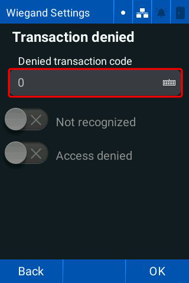

---

<!-- Page 63 -->

                 Powering                                                              HID® Amico™ VL35LF Biometric Reader
                 Trusted Identities                                                                            User Guide

 8. Tap Next. The Wiegand Debug screen is displayed.

        Note: This screen verifies the data received by the readers Wiegand input interface.
 9. Tap OK.

PLT-07752, A.0                                              63                                                   April 2025

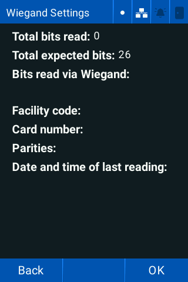

---

<!-- Page 64 -->

                 Powering                                                         HID® Amico™ VL35LF Biometric Reader
                 Trusted Identities                                                                       User Guide

4.10 OSDP
 1. Tap Menu > Access > Next > OSDP. The OSDP screen is displayed.

 2. Tap the OSDP toggle to enable/disable the OSDP protocol.
 3. Tap the Module Address keyboard and enter the required address.
 4. Tap the required Baud Rate to set the communication speed of the RS-485 bus for the OSDP protocol.
 5. Tap Next to continue.

PLT-07752, A.0                                          64                                                  April 2025

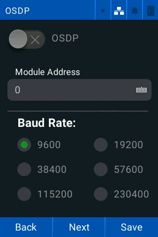

---

<!-- Page 65 -->

                 Powering                                                 HID® Amico™ VL35LF Biometric Reader
                 Trusted Identities                                                               User Guide

 6. Tap the required Format.
      l   Binary: reads directly from the card
      l   Wiegand: reads Wiegand formats
      l   ASCII: reads text representation of data

 7. Tap the required Size if Wiegand is selected. Tap Next to continue.

PLT-07752, A.0                                            65                                        April 2025

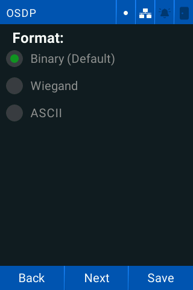

---

<!-- Page 66 -->

                 Powering                                                             HID® Amico™ VL35LF Biometric Reader
                 Trusted Identities                                                                           User Guide

 8. Tap the Mandatory Secure Channel toggle to enable/disable it. This configures the reader to only work when
    connected to a secure channel.

 9. Tap the Installation Mode toggle to enable/disable the on-screen message displaying the installation mode.
        Note: You must wait for the mandatory OSDP activation to restart before Installation Mode is enabled.
10. Tap the required Output mode.
11. Tap Save.
12. Tap OK to restart the reader.

PLT-07752, A.0                                             66                                                   April 2025

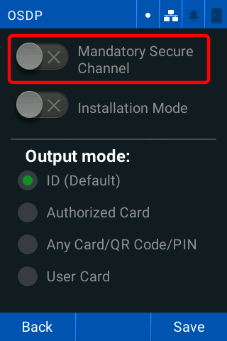

---

<!-- Page 67 -->

                 Powering                                                             HID® Amico™ VL35LF Biometric Reader
                 Trusted Identities                                                                           User Guide

4.11 Global network interlocking
This allows you to configure two readers to control a single area. One door always remains locked, for example a
quarantine zone.

 1. Tap Menu > Access > Next > Global Network Interlocking. The Network Interlocking screen is displayed.

 2. Tap the Enable remote interlocking toggle to enable/disable remote interlocking.
 3. Tap the Bypass interlocking when opening door via API toggle to enable/disable bypassing the interlock when
    opening a door via the API.
 4. Tap the Bypass interlocking when opening door through REX toggle to enable/disable bypassing the interlock
    when opening a door via a request to exit button.
 5. Tap Save.

PLT-07752, A.0                                             67                                                      April 2025

---

<!-- Page 68 -->

                 Powering                                                      HID® Amico™ VL35LF Biometric Reader
                 Trusted Identities                                                                    User Guide

4.11.1 To add an interlock
 1. Tap Menu > Access > Next > Global Network Interlocking.
 2. Tap the Add icon.

 3. Tap the Rule Name keyboard and enter the required name.
 4. Tap the Remote Device IP keyboard and enter the required name.
 5. Tap the Remote Device Login keyboard and enter the required login.
 6. Tap the Remote Device Password keyboard and enter the required password.
 7. Tap the Enable rule toggle to enable the interlocking rule.
 8. Tap Test connection to test the connection between the two readers.
 9. Tap OK.

PLT-07752, A.0                                             68                                            April 2025

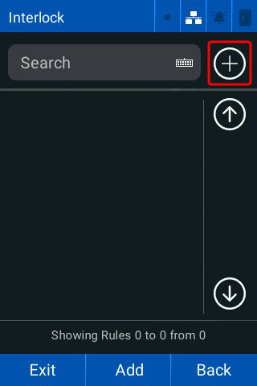

---

<!-- Page 69 -->

                 Powering                                                       HID® Amico™ VL35LF Biometric Reader
                 Trusted Identities                                                                     User Guide

4.11.2 Edit interlocking rules
 1. Tap Menu > Access > Next > Global Network Interlocking. The Network Interlocking screen is displayed.

 2. Tap Edit interlocking rules.
 3. Tap the required data fields and make the required changes.
 4. Tap OK.
 5. Tap Save.

PLT-07752, A.0                                           69                                               April 2025

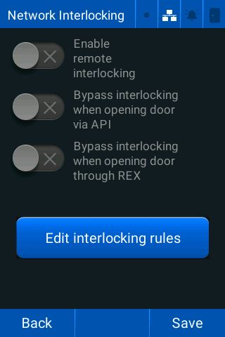

---

<!-- Page 70 -->

Section 05
Facial settings

---

<!-- Page 71 -->

                 Powering                                                                HID® Amico™ VL35LF Biometric Reader
                 Trusted Identities                                                                              User Guide

5.1 Facial settings
The Facial Settings screen allows you to adjust all camera, video, and face ID criteria settings.

Tap Menu > Facial Settings. The Facial Settings screen is displayed.

PLT-07752, A.0                                               71                                                    April 2025

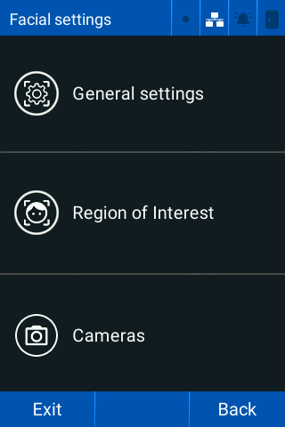

---

<!-- Page 72 -->

                 Powering                                                                HID® Amico™ VL35LF Biometric Reader
                 Trusted Identities                                                                              User Guide

5.2 General settings
 1. Tap Menu > Facial settings > General settings. The Camera screen is displayed.

 2. Tap the required Mask detection setting:
      l   Disabled
      l   Wearing a mask is mandatory
      l   Wearing a mask is recommended
 3. Tap the Identification distance (cm) keyboard and enter the required distance in centimeters.
 4. Tap the required Detection Mode:
      l   Pedestrian
      l   Vehicle
 5. Tap Next to continue.
 6. Tap the required Liveness mode:
      l   Normal (default): normal environments
      l   Rigorous: environments with poor lighting
 7. Tap the Limit identification to display region toggle to only identify faces in the region of interest.

PLT-07752, A.0                                               72                                                    April 2025

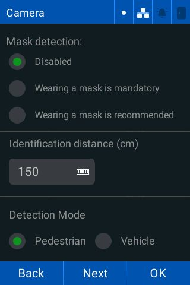

---

<!-- Page 73 -->

                 Powering                                                          HID® Amico™ VL35LF Biometric Reader
                 Trusted Identities                                                                        User Guide

 8. Tap the Keep user image toggle to keep/remove user photos after enrollment.

 9. Tap the Time to grant access to the same face (s) keyboard and enter the duration a user must wait to be
    identified after their last facial identification. Tap Next to continue.

PLT-07752, A.0                                          73                                                     April 2025

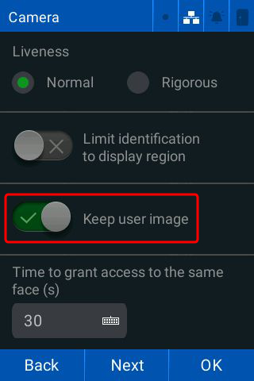

---

<!-- Page 74 -->

                 Powering                                                          HID® Amico™ VL35LF Biometric Reader
                 Trusted Identities                                                                        User Guide

10. Tap the required White LED activation brightness.
      l   Low
      l   Medium
      l   High
      l   Any

11. Tap the LEDs brightness keyboard to enter the required LED brightness (1-100). Tap Next to continue.

PLT-07752, A.0                                          74                                                   April 2025

---

<!-- Page 75 -->

                 Powering                                                          HID® Amico™ VL35LF Biometric Reader
                 Trusted Identities                                                                        User Guide

12. Tap Send access photo to the Monitor server toggle to send the access photo of the identified user to the
    Monitor server.

13. Tap OK.

5.2.1 Region of interest
 1. Tap Menu > Facial settings > Region of Interest. The Region of Interest adjustment screen is displayed.
 2. Make the required adjustments:
      l   Vertical Image Shift: moves the camera up or down
      l   Zoom: zooms in or out
 3. Tap Confirm.

PLT-07752, A.0                                            75                                                    April 2025

---

<!-- Page 76 -->

                 Powering                                                         HID® Amico™ VL35LF Biometric Reader
                 Trusted Identities                                                                       User Guide

5.3 Cameras
Tap Menu > Facial settings > Cameras. The Cameras screen is displayed.

5.3.1 Diagnostics
 1. Tap Menu > Facial settings > Cameras > Diagnostic.
 2. Tap White LEDs to test that the white LEDs are operating.
 3. Tap IR LEDs to test that the infrared LEDs are operating.
 4. Tap Infrared/Colored to alternate between the infrared camera and color camera.
 5. Tap Back to return to the previous menu.

PLT-07752, A.0                                            76                                                April 2025

---

<!-- Page 77 -->

                 Powering                                                            HID® Amico™ VL35LF Biometric Reader
                 Trusted Identities                                                                          User Guide

5.3.2 Video streaming
This allows you to configure the reader to stream video from the camera via RTSP, or ONVIF protocols.

RTSP
 1. Tap Menu > Facial settings > Cameras > Video Streaming. The Video config screen is displayed.

PLT-07752, A.0                                            77                                                   April 2025

---

<!-- Page 78 -->

                 Powering                                                           HID® Amico™ VL35LF Biometric Reader
                 Trusted Identities                                                                         User Guide

 2. Tap RTSP.

 3. Tap the RTSP Port keyboard and enter the required port (554 by default). Tap Next to continue.
 4. Tap the required video Orientation.

PLT-07752, A.0                                           78                                                   April 2025

---

<!-- Page 79 -->

                 Powering                                                          HID® Amico™ VL35LF Biometric Reader
                 Trusted Identities                                                                        User Guide

 5. Tap the Mirrored Image toggle to flip the image horizontally.
 6. Tap the Enable Watermark toggle to enable/disable the watermark that appears on the facial recognition screen.
    Tap Next to continue.
 7. Tap the required Camera Configuration:
      l   RGB (default)
      l   IR (InfraRed)
      l   Auto
 8. Tap the required Codec:
      l   MJPEG (default)
      l   H264
 9. Tap the Login keyboard and enter the required login.

10. Tap the Password keyboard and enter the required password. Tap Next to continue.

PLT-07752, A.0                                             79                                                April 2025

---

<!-- Page 80 -->

                 Powering                                                             HID® Amico™ VL35LF Biometric Reader
                 Trusted Identities                                                                           User Guide

11. Tap Save to use the RTSP stream URL with compatible software (VLC media player or Windows media player).

        Note: Copy and save the URL in a safe place.
12. Restart the reader for the configuration changes to take effect. See 6.10 Restart for more information.

PLT-07752, A.0                                             80                                                   April 2025

---

<!-- Page 81 -->

                 Powering                                                           HID® Amico™ VL35LF Biometric Reader
                 Trusted Identities                                                                         User Guide

ONVIF streaming
 1. Tap Menu > Facial settings > Cameras > Video Streaming. The Video config screen is displayed.
 2. Tap ONVIF.

 3. Tap the ONVIF Port keyboard and enter the required port (8000 by default). Tap Next to continue.

PLT-07752, A.0                                           81                                                   April 2025

---

<!-- Page 82 -->

                 Powering                                                          HID® Amico™ VL35LF Biometric Reader
                 Trusted Identities                                                                        User Guide

 4. Tap the required Orientation.

 5. Tap the Mirrored Image toggle to flip the image horizontally.
 6. Tap the Enable Watermark toggle to enable/disable the watermark that appears on the facial recognition screen.
    Tap Next to continue.

PLT-07752, A.0                                            82                                                 April 2025

---

<!-- Page 83 -->

                  Powering                                                            HID® Amico™ VL35LF Biometric Reader
                  Trusted Identities                                                                          User Guide

 7. Tap the required Camera Configuration:
       l   RGB (default)
       l   IR (InfraRed)
       l   Auto

 8. Tap Save.
 9. Restart the reader for the configuration changes to take effect. See 6.10 Restart for more information.

  Note:
  l ONVIF uses the default credentials:

       l   Login - admin
       l   Password - admin
   l   ONVIF streaming only works if RTSP is active and operating correctly.

Validate the ONVIF Streaming using the ONVIF Device Manager.

5.3.3 Camera calibration
This allows you to calibrate the camera.

 1. Tap Menu > Facial Settings > Cameras > Camera Calibration.
 2. Tap Start calibration and follow the on-screen prompts.

PLT-07752, A.0                                              83                                                  April 2025

---

<!-- Page 84 -->

Section 06
Settings

---

<!-- Page 85 -->

                 Powering                                                           HID® Amico™ VL35LF Biometric Reader
                 Trusted Identities                                                                         User Guide

6.1 Network settings
The HID Amico can connect to a network via an Ethernet cable (10/100Mbps), using the TCP/IP protocol with the reader
in Online mode. Configure the IP address, the subnet mask, and the gateway of the reader to access the web interface.

You can configure the native Wiegand inputs and outputs to work with the Wiegand 26 protocol (standard).

Tap Menu > Settings > Network. The Network settings menu is displayed.

PLT-07752, A.0                                           85                                                   April 2025

---

<!-- Page 86 -->

                 Powering                                                         HID® Amico™ VL35LF Biometric Reader
                 Trusted Identities                                                                       User Guide

6.1.1 Network properties
 1. Tap Menu > Settings > Network > Network Properties. The Network screen is displayed.

 2. Tap the IP keyboard and enter the required static reader IP address.
 3. Tap the Netmask keyboard and enter the required Netmask.
 4. Tap the Gateway keyboard and enter the required network gateway IP address.
 5. Tap the Port (Web) keyboard and enter the required network port.
 6. Tap the DHCP checkbox to enable/disable the DHCP protocol for network configuration.
        Note: The IP, Netmask, and Gateway settings are configured automatically. They cannot be changed when
              the DHCP protocol is enabled.
 7. Tap Next to continue.

PLT-07752, A.0                                            86                                                April 2025

---

<!-- Page 87 -->

                 Powering                                                       HID® Amico™ VL35LF Biometric Reader
                 Trusted Identities                                                                     User Guide

 8. Tap the Primary and Secondary DNS keyboards and enter the required DNS server information.

 9. Tap Next to continue.
10. Tap the 802.1X toggle to enable/disable the 802.1X protocol.

PLT-07752, A.0                                           87                                               April 2025

---

<!-- Page 88 -->

                 Powering                                                           HID® Amico™ VL35LF Biometric Reader
                 Trusted Identities                                                                         User Guide

11. Tap the required 802.1X Authentication option:
      l   PEAP
      l   TTLS
12. Tap the required Inner Authentication option:
      l   MS-CHAPv2
      l   MD5
      l   GTC
13. Tap Next to continue.
14. Tap the Login keyboard and enter the required login.
15. Tap the Password keyboard and enter the required password.
16. The 802.1X status is displayed at the bottom of the screen. See A.1 802.1X status for more information.

17. Tap Next to continue.

PLT-07752, A.0                                             88                                                 April 2025

---

<!-- Page 89 -->

                 Powering                                             HID® Amico™ VL35LF Biometric Reader
                 Trusted Identities                                                           User Guide

18. Tap the SSL Protocol toggle to enable/disable the SSL protocol.

19. Tap OK to save the network settings.

PLT-07752, A.0                                           89                                     April 2025

---

<!-- Page 90 -->

                 Powering                                                          HID® Amico™ VL35LF Biometric Reader
                 Trusted Identities                                                                        User Guide

6.1.2 OpenVPN
 1. Tap Menu > Settings > Network > OpenVPN. The OpenVPN screen is displayed.

 2. Tap the OpenVPN toggle to enable/disable OpenVPN.
 3. Tap the Manual Login and Password toggle to enable/disable the manual login.
 4. Tap the Login keyboard and enter the required login.
 5. Tap the Password keyboard and enter the required password.

PLT-07752, A.0                                             90                                                April 2025

---

<!-- Page 91 -->

                 Powering                                              HID® Amico™ VL35LF Biometric Reader
                 Trusted Identities                                                            User Guide

 6. Tap Next to continue. The VPN Status screen is displayed.

      Status      Description
      Green       Reader connected to OpenVPN
      Grey        OpenVPN disabled or failed security protocol.
      Red         Reader authentication failure.
 7. Tap OK.

PLT-07752, A.0                                                    91                             April 2025

---

<!-- Page 92 -->

                 Powering                                                        HID® Amico™ VL35LF Biometric Reader
                 Trusted Identities                                                                      User Guide

6.1.3 Reader name
 1. Tap Menu > Settings > Network > Device name.
 2. Tap the Custom device name toggle to enable/disable the option to change the reader name.

 3. Tap the Device name keyboard and enter the required reader name.
 4. Tap OK.

PLT-07752, A.0                                         92                                                  April 2025

---

<!-- Page 93 -->

                 Powering                                                           HID® Amico™ VL35LF Biometric Reader
                 Trusted Identities                                                                         User Guide

6.2 Date and time
The Date and time screen allows you to configure the Network Time Protocol (NTP) to synchronize the readers clocks
on the network which allows all events, transactions, and reader logs to be recorded consistently.

 1. Tap Menu > Settings > Date and time. The Date and time screen is displayed.

 2. Tap the Date keyboard and enter the required date.
 3. Tap the Time keyboard and enter the required time.
 4. Tap the Daylight saving time - Begins keyboard and enter the required start date.
 5. Tap the Daylight saving time - Ends keyboard and enter the required end date.
 6. Tap Next to continue.
 7. Tap the NTP toggle to enable/disable the Network Time Protocol.

PLT-07752, A.0                                           93                                                   April 2025

---

<!-- Page 94 -->

                 Powering                                               HID® Amico™ VL35LF Biometric Reader
                 Trusted Identities                                                             User Guide

 8. Tap the Server keyboards and enter the required server addresses.

        Note: Server 2 is optional.
 9. Select the required Time zone from the drop-down list.

PLT-07752, A.0                                           94                                       April 2025

---

<!-- Page 95 -->

                 Powering                                                           HID® Amico™ VL35LF Biometric Reader
                 Trusted Identities                                                                         User Guide

10. Tap Next to continue. The NTP Server Status is displayed.

      Color            Status
      White            Deactivated
      Green            Connected
      Red              Disconnected
11. Tap the Time in 24h format toggle to alternate between 24 hour clock or 12 hour clock.
12. Tap the required Date format.
13. Tap OK to save the date and time settings.

PLT-07752, A.0                                           95                                                   April 2025

---

<!-- Page 96 -->

                 Powering                                                             HID® Amico™ VL35LF Biometric Reader
                 Trusted Identities                                                                           User Guide

6.3 Alarms
6.3.1 Internal alarms
 1. Tap Menu > Settings > Alarms > Internal alarms.
 2. Tap the Door held open checkbox to enable/disable the detection of an open door.

 3. Tap the Time to activate (s) keyboard and enter the required time (seconds) for the alarm to trigger after sensor
    activation.
 4. Tap the Trigger time after relay closing (s) keyboard and enter the required time in seconds that the alarm is
    triggered if the door is kept open.
 5. Tap Next to continue.

PLT-07752, A.0                                             96                                                   April 2025

---

<!-- Page 97 -->

                 Powering                                                           HID® Amico™ VL35LF Biometric Reader
                 Trusted Identities                                                                         User Guide

 6. Tap the Door forced open checkbox to enable/disable the detection of a break-in.

 7. Tap the Debounce detection (ms) keyboard and enter the required time (milliseconds) for a break-in detection
    alarm.
 8. Tap the Tamper detection checkbox to enable/disable the reader tamper sensor.
 9. Tap OK to save.

PLT-07752, A.0                                           97                                                   April 2025

---

<!-- Page 98 -->

                 Powering                                                               HID® Amico™ VL35LF Biometric Reader
                 Trusted Identities                                                                             User Guide

6.3.2 Duress settings
Allows you to set a panic alarm, triggered by holding a card next to the reader for a configured amount of time.

 1. Tap Menu > Settings > Alarms > Internal Alarms > Next > Duress. The Duress Alarm screen is displayed.
 2. Tap the Duress card checkbox to enable/disable the alarm.

 3. Tap the Time to activate (s) keyboard and enter the required time (seconds) the card must be held to the reader.
 4. Tap OK.

PLT-07752, A.0                                              98                                                     April 2025

---

<!-- Page 99 -->

                 Powering                                                            HID® Amico™ VL35LF Biometric Reader
                 Trusted Identities                                                                          User Guide

6.3.3 Alarm output
 1. Tap Menu > Settings > Alarm > Alarm Output. The Alarm Output screen is displayed.

 2. Tap the Enable audible alarm checkbox to enable/disable the audible alarm.
 3. Tap the Alarm duration (s) keyboard and enter the required time (seconds) to trigger the audible alarm.
 4. Tap OK.

PLT-07752, A.0                                            99                                                   April 2025

---

<!-- Page 100 -->

                 Powering                                                HID® Amico™ VL35LF Biometric Reader
                 Trusted Identities                                                              User Guide

6.4 Language settings
 1. Tap Menu > Settings > Languages. The Language screen is displayed.

 2. Tap the required Language.

PLT-07752, A.0                                       100                                           April 2025

---

<!-- Page 101 -->

                 Powering                                                            HID® Amico™ VL35LF Biometric Reader
                 Trusted Identities                                                                          User Guide

6.5 System information
The System information screen allows you to see the reader and system information.

 1. Tap Menu > Settings > General settings > System > System information. The System information screen is
    displayed.

 2. Tap OK.

PLT-07752, A.0                                          101                                                    April 2025

---

<!-- Page 102 -->

                 Powering                                                            HID® Amico™ VL35LF Biometric Reader
                 Trusted Identities                                                                          User Guide

6.6 Display
The Display screen allows you to configure the power settings and calibrate the screen.

 1. Tap Menu > Settings > General settings > System > Display. The Display screen is displayed.

PLT-07752, A.0                                            102                                                  April 2025

---

<!-- Page 103 -->

                 Powering                                                              HID® Amico™ VL35LF Biometric Reader
                 Trusted Identities                                                                            User Guide

6.6.1 Display calibration
 1. Tap Menu > Settings > General settings > System > Display > Calibrate Screen.
 2. Read the message that is displayed and tap OK.

 3. The reader will reboot in calibration mode. Tap the marks on the screen and wait for the reader to calibrate.

PLT-07752, A.0                                             103                                                      April 2025

---

<!-- Page 104 -->

                 Powering                                                            HID® Amico™ VL35LF Biometric Reader
                 Trusted Identities                                                                          User Guide

6.6.2 Power settings
The Display screen allows you to configure the readers power saving settings.

 1. Tap Menu > Settings > General settings > System > Display > Power Settings. The Display screen is displayed.

 2. Tap the Display always on toggle to enable/disable the display always on mode.
 3. If the Display always on mode is disabled, tap the Wait time (s) keyboard and enter the required time before the
    screen turns off when idle.

6.6.3 Protection against accidental touches
This allows you to configure the duration that user must tap and hold the Menu button to access the menu.

 1. Tap the Protection activated toggle to enable/disable protection against accidental touches.
 2. Tap the Touch duration (s) keyboard and set the duration the user is required to tap and hold the Menu button.
 3. Tap OK to save.

PLT-07752, A.0                                           104                                                   April 2025

---

<!-- Page 105 -->

                 Powering                                                            HID® Amico™ VL35LF Biometric Reader
                 Trusted Identities                                                                          User Guide

6.7 Diagnostics
The Diagnostic screen allows you to configure reader diagnosis and general report settings.

  Caution: The following features can cause the reader to reboot or be accessed remotely. Only use them for support
           if your reader has issues.

 1. Tap Menu > Settings > General settings > Diagnostic. The Diagnostic screen is displayed.

 2. Tap the SSH Access toggle to enable/disable access via SSH.
 3. Tap the Reboot URL toggle to enable/disable restarting the reader without a valid session.
 4. Tap Save.

PLT-07752, A.0                                           105                                                   April 2025

---

<!-- Page 106 -->

                 Powering                                                     HID® Amico™ VL35LF Biometric Reader
                 Trusted Identities                                                                   User Guide

6.8 Modify user name and web password
 1. Tap Menu > Settings > General settings > Change web password. The Web password screen is displayed.

 2. Tap the New user keyboard and enter the required user name.
 3. Tap the New password keyboard and enter the required password.
 4. Tap the Confirm the password keyboard and confirm the new password.
 5. Tap OK.

PLT-07752, A.0                                        106                                               April 2025

---

<!-- Page 107 -->

                 Powering                                                                HID® Amico™ VL35LF Biometric Reader
                 Trusted Identities                                                                              User Guide

6.9 Restore settings
The Restore Configuration screen allows you to restore the reader to default settings.

 1. Tap Menu > Settings > General settings > Restore Configuration. The Restore Configuration screen is displayed.

 2. Tap the Keep network settings toggle to keep/remove the network settings.
 3. Tap the Keep all configurations toggle to keep/remove all configurations.
 4. Tap Restore.

PLT-07752, A.0                                            107                                                      April 2025

---

<!-- Page 108 -->

                 Powering                                                             HID® Amico™ VL35LF Biometric Reader
                 Trusted Identities                                                                           User Guide

6.10 Restart
The Reboot screen allows you to configure an automatic restart time for the reader, or restart the system immediately.

 1. Tap Menu > Settings > General settings > Reboot. The Reboot screen is displayed.

 2. Tap the Automatic reboot time toggle to enable/disable the automatic restart time.
 3. Tap the Automatic reboot time keyboard and enter the required restart time.
        Note: Tap Reboot to restart the reader immediately.

PLT-07752, A.0                                            108                                                   April 2025

---

<!-- Page 109 -->

                 Powering                                                           HID® Amico™ VL35LF Biometric Reader
                 Trusted Identities                                                                         User Guide

6.11 About
The About screen allows you to view the reader information, update the reader firmware, and view the terms and
conditions of use.

 1. Tap Menu > About. The About screen is displayed.

 2. Tap Back to return to the main menu.

PLT-07752, A.0                                           109                                                     April 2025

---

<!-- Page 110 -->

                 Powering                                                        HID® Amico™ VL35LF Biometric Reader
                 Trusted Identities                                                                      User Guide

6.11.1 Legal information
 1. Tap Menu > About > Legal Information. The Legal Information screen is displayed.

 2. Scan the QR Code for more information.
        Note: Enter the URL into a web browser if you cannot scan the code.
 3. Tap Exit to return to the main menu.

PLT-07752, A.0                                            110                                              April 2025

---

<!-- Page 111 -->

                 Powering                                                             HID® Amico™ VL35LF Biometric Reader
                 Trusted Identities                                                                           User Guide

6.11.2 Firmware update
This allows you to update the reader firmware version.

  Important: It is recommended to keep the reader firmware up to date. Check regularly for new firmware
             versions.

 1. Tap Menu > About. The About screen is displayed.
 2. Tap Firmware update.

 3. The reader searches for new firmware versions and notifies you if a new version is available. Follow the on-screen
    instructions if a new firmware version is found.

PLT-07752, A.0                                            111                                                   April 2025

---

<!-- Page 112 -->

Section 07
Technical specifications

---

<!-- Page 113 -->

                   Powering                                                          HID® Amico™ VL35LF Biometric Reader
                   Trusted Identities                                                                        User Guide

7.1 Technical specifications
 Features                               Description
 LCD type                               3.5" TFT color LCD display with capacitive touchscreen
 CPU                                    1.5 GHz quad-core processor
 Audio feedback                         Buzzer
 Visual feedback                        Multicolor LED indicator / illuminator
 Operating temperature                  -20°C to 50°C 0% ~ 80%, non-condensing
 Camera                                 Two 1080p full HD cameras (visible light and infrared light)
 RTSP                                   Supported
 Tamper                                 Supported
 Dimensions mm (W × H × D)              86 × 142 × 26 (terminal) and 52 × 52 × 22 (EAM)
 Weight                                 343g (device), 540g (boxed)
 Power                                  12VDC 2A or PoE
 Power consumption                      400mA @ 12V idle, maximum 600mA @ 12V
 PoE                                    802.3af PoE (802.3at/PoE+ and 802.3bt/PoE++ compatible)
 IP Rating                              IP65
 Certifications                         CE, FCC, CB, IC, UKCA, ANATEL, RoHS
 Warranty                               12 months
 Authentication distance                Up to 3m
 Mounting height                        1.40m
 Matching speed                         Within 0.2 seconds
 Throughput                             30 persons per min 1:N
 Live face detection (Anti-spoofing)    Presentation attack detection supported
 Minimum Light Level                    Complete darkness
 HF (13.56 MHz)                         Seos® iCLASS®, iCLASS SE™, ISO 14443A (MIFARE) CSN, ISO 14443B CSN,
                                        DESFIRE EV1/2/3 ***
 LF (125 kHz)                           HID PROX®
 Mobile (2.4GHz)                        Bluetooth LE
 Template on card                       Seos Secure Identity Object™ (SIO)
 Typical RF read range                  Seos 0.4in (1cm), iCLASS 2.36in (6cm), Prox 1.57in (4cm)
 Keypad (PIN)                           Supported on TFT LCD
 QR                                     Static (ISO/IEC 18004:2015) and dynamic (6238 TOTP) QR Supported
 Max. user                              200,000
 Max credential                         Face: 10,000 / PIN 200,000 / Card: 200,000
 Event log capacity                     200,000

PLT-07752, A.0                                      113                                                        April 2025

---

<!-- Page 114 -->

                   Powering                                                        HID® Amico™ VL35LF Biometric Reader
                   Trusted Identities                                                                      User Guide

 Features                               Description
 Ethernet                               1 native 10/100Mbps Ethernet port
 RS-485                                 1 RS-485 port for communication with the external access control module or
                                        OSDP
 RS-485 Protocol                        OSDP v2 compliant
 USB                                    USB 2.0 available through a USB C connector in the back of the product (service
                                        only)
 Relay                                  1x NO/NC, max. 30VAC / 5A (EAM)
 I/O                                    1x Door Sensor, 1x Pushbutton (EAM)
 Wiegand                                1x Input, 1x Output (EAM)

PLT-07752, A.0                                     114                                                           April 2025

---

<!-- Page 115 -->

Appendix A
802.1X Status

---

<!-- Page 116 -->

                  Powering                                                                        HID® Amico™ VL35LF Biometric Reader
                  Trusted Identities                                                                                      User Guide

A.1 802.1X status
 Status                   Description
 Initializing             Authentication process is initializing
 Disconnected             802.1X authentication is disabled, or cannot connect to the authenticator or authenticator server.
 Connecting               The reader is connecting to the authenticator and authentication server.
 Authenticating           The authentication process is running.
 Authenticated            The reader has been authenticated on the network.
 Aborting                 The authentication process is being aborted.
 Detained                 The reader authentication failed.
 Forcibly authorizing     The 802.1X authentication process is disabled and the reader network port is authorized without performing
                          the authentication process.
 Forcibly deauthorizing   The reader network port is not authorized. Any authentication attempt is ignored.
 Restarting               The reader is restarting.
 Unknown 802.1X status    An internal error prevented the reader from booting correctly.

PLT-07752, A.0                                                     116                                                         April 2025

---

<!-- Page 117 -->

Appendix B
Face capture best practices

---

<!-- Page 118 -->

                 Powering                                                                  HID® Amico™ VL35LF Biometric Reader
                 Trusted Identities                                                                                User Guide

B.1 Face capture - best practices
Accurate user identification relies on correct face registration. Follow the best practices to ensure correct facial
registration:

 1. Environment
      l   Lighting - ensure good, even lighting. Avoid very bright or low-light environments.
      l   Background - use a white or neutral color background. Avoid complex or colorful backgrounds.
 2. Positioning
      l   Distance - between 60cm and 150cm from the reader
      l   Centering - position the face in the center of the frame
      l   Angle - the face should be straight and looking directly at the camera
 3. Taking the photo
      l   Resolution - the face should cover at least 160px from ear to ear. Do not resize the image or change its aspect
          ratio.
      l   Format - PNG. (JPEG can be used with a quality factor of 95 or higher).
      l   Number of faces - only one face must be present in the image
      l   Accessories - no masks, hats, helmets or sunglasses. Spectacles are acceptable if no reflections are visible in
          the lenses.
      l   Facial expressions - the face must be in a neutral expression

B.2 Image examples
Correct image examples

PLT-07752, A.0                                                118                                                      April 2025

---

<!-- Page 119 -->

                 Powering                   HID® Amico™ VL35LF Biometric Reader
                 Trusted Identities                                 User Guide

Incorrect image examples

PLT-07752, A.0                        119                             April 2025

---

<!-- Page 120 -->

                 Powering                    HID® Amico™ VL35LF Biometric Reader
                 Trusted Identities                                  User Guide

Revision history
 Date               Description                                     Revision
 April 2025         Initial release.                                A.0

PLT-07752, A.0                         120                                April 2025

---

<!-- Page 121 -->

For technical support, please visit: https://support.hidglobal.com

© 2025 HID Global Corporation/ASSA ABLOY AB.
All rights reserved.
PLT-07752, Rev. A.0

Part of ASSA ABLOY

---

<!-- Page 122 -->

---
